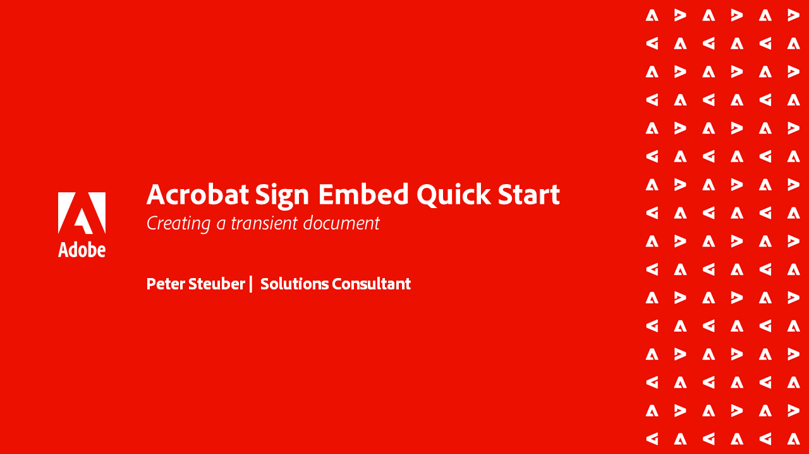

# Acrobat Sign API tutorials

Acrobat Sign APIs allow you to create apps and embed the Acrobat Sign UI and functionality into your applications.

## Getting started

<table style="table-layout:fixed">
<tr>
   <td>
    
    

    <a href="signapi.md"><strong>Getting started</strong></a>
    

    <em>Learn how to include Sign API in your application to gather signatures and other information</em>
     
  </td>
  <td>
    
    

     
  </td>
  <td>
    
    

     
  </td>
  <td>
    
    

     
  </td>
</tr>
</table>

## Acrobat Sign Embed Quick Start Guide

Learn how get started embedded the OEM version of Acrobat Sign into your application. This guide is specifically designed for OEM partners that are building and embedding a signature process within their application.

<table style="table-layout:fixed">
<tr>
 <td>
   
    

   <a href="sign-up-developer-account.md"><strong>Signing up for a Developer Account</strong></a>
    

    <em>Learn how to sign up for a Developer Account for Acrobat Sign, which is fully enabled with Sign and API functionality</em>
     
  </td>
  <td>
   
    

   <a href="creating-your-application.md"><strong>Creating your application</strong></a>
    

    <em>Learn how to create an application in Acrobat Sign</em>
     
  </td>
   <td>
   
    

   <a href="creating-an-embed-link.md"><strong>Creating an embed link</strong></a>
    

    <em>Learn how to create an embed link for OAuth, which is the method that your application gets permissions for users</em>
     
  </td>
  <td>
   
    

   <a href="generating-an-access-token.md"><strong>Generating an access token</strong></a>
    

    <em>Learn how to generate an access token that can be used with the Acrobat Sign API</em>
     
  </td>
</tr>
<tr>
  <td>
   
    

   <a href="creating-a-transient-document.md"><strong>Creating a transient document</strong></a>
    

    <em>Learn how to create a transient document that can be used with the Acrobat Sign AP</em>
     
  </td>
  <td>
    
    

     
  </td>
   <td>
    
    

     
  </td>
  <td>
    
    

     
  </td>
</tr>
</table>
