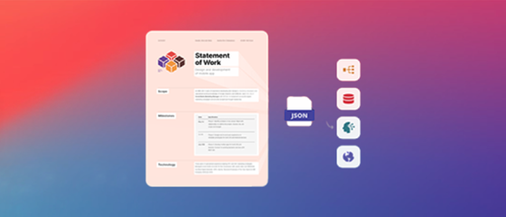

# [!DNL Adobe Acrobat Services] API tutorials

[!DNL Adobe Acrobat Services] has six main APIs:

* [!DNL Adobe PDF Services API]
* [!DNL Adobe PDF Embed API]
* [!DNL Adobe Document Generation API]
* [!DNL Adobe PDF Electronic Seal API]
* [!DNL Adobe PDF Extract API]
* [!DNL Adobe PDF Accessibility Auto-Tag API]

The latter two APIs and their SDKs are bundled into [!DNL Adobe PDF Services API] as part of a paid offering. [!DNL PDF Embed API] is a free offering. These APIs automate the generation, manipulation, and transformation of document content via a set of modern cloud-based web services. They help you deliver simpler, faster, and branded experiences so that you control user interaction with your documents, streamline PDF workflows and promote usage and retention. These tutorials help you get up-to-speed delivering simpler, faster, branded experiences with the [!DNL Adobe Acrobat Services] APIs.

<table style="table-layout:fixed">
<tr>
 <td>
   
  </td>
  <td>
   
  </td>
  <td>
   
  </td>
  <td>
   
  </td>
</tr>
<tr>
  <td>
   
  </td>
 <td>
   
  </td>
 <td>
   
  </td>
 <td>
   
  </td>
</tr>
</table>
