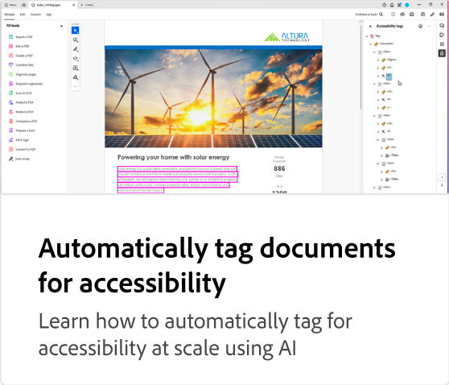

# Adobe PDF Accessibility Auto-Tag API tutorials

This AI-powered API automatically tag tables, paragraphs, lists, headings and more to improve the reading experience of native or scanned PDFs with assistive technologies. It also identifies the reading order to ensure the logical flow of information with multiple columns or elements across pages. Apply this to document backlogs or new document workflows and move towards compliance with greater ease.

<table style="table-layout:fixed">
<tr>
  <td>
    
    

      <a href="automatically-add-tags.md"><strong>Automatically tag documents for accessibility</strong></a>
      

      Learn how to automatically tag for accessibility at scale using AI
       
  </td>
 <td>
       
       

        
 </td>
 <td>
       
       

        
 </td>
 <td>
       
       

        
 </td>
</tr>
</table>