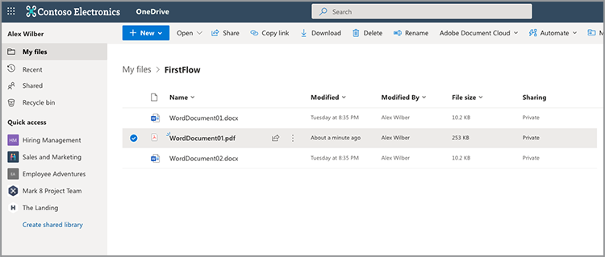
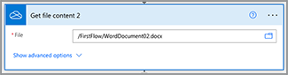

# Create your first flow in Microsoft Power Automate

Learn how to create your first flow in [Microsoft Power Automate](https://flow.microsoft.com) using the [Adobe PDF Services](https://us.flow.microsoft.com/en-us/connectors/shared_adobepdftools/adobe-pdf-services/) connector. 

In this hands-on tutorial learn how to:

* Convert Word documents to PDF
* Combine PDF documents into one PDF
* Protect a PDF document with a password

## Preparation

### What you need

* **Trial or production credentials for Adobe PDF Services**
    Learn more about how to get and configure credentials in Microsoft Power Automate [here](https://experienceleague.adobe.com/docs/document-services/tutorials/pdfservices/getting-credentials-power-automate.html).
* **Microsoft Power Automate with Premium connectors**
    Learn how to check the  level of licensing for Power Automate [here](https://docs.microsoft.com/en-us/power-platform/admin/power-automate-licensing/types).
* **OneDrive**
    The OneDrive storage connector is used in this tutorial, but any storage connector can be substituted.

### Sample files

There are two [sample files](assets/sample-assets.zip) that you need to unzip and upload to OneDrive:

* WordDocument01.docx
* WordDocument02.docx

### Getting credentials

To complete this tutorial, you need your credentials already configured in Microsoft Power Automate for Adobe PDF Services. If you have not completed this step, see the [instructions here](https://experienceleague.adobe.com/docs/document-services/tutorials/pdfservices/getting-credentials-power-automate.html).

## Part 1: Create new flow and convert Word to PDF

### Create the flow

In this part, you create a new flow in [Microsoft Power Automate](https://flow.microsoft.com) using an instant flow, add parameters, get your files from OneDrive, and convert them to PDF.

1. Navigate to [Microsoft Power Automate](https://flow.microsoft.com) and log in with your credentials.
1. In the sidebar, select **[!UICONTROL Create]**.

    

1. Select **[!UICONTROL Instant Flow]**.  
1. Give your flow a name.
1. Under *Choose how to trigger this flow*, select **[!UICONTROL Manually trigger a flow]**.
1. Select **[!UICONTROL Create]**.

### Get file contents of files

Next, get the file contents of the sample files. 

>[!PREREQUISITES]
>
>If you haven't uploaded the [sample files](assets/sample-assets.zip) into OneDrive, unzip them and upload them.


1. In [Power Automate](https://flow.microsoft.com), select **[!UICONTROL + New step]**.
1. Search for *OneDrive* in the search bar.
1. Choose either your work or personal OneDrive account by selecting **[!UICONTROL OneDrive for Business]** or **[!UICONTROL OneDrive]**.
1. Search for *Get file content* in the search bar.
1. In the **[!UICONTROL File]** field, select the Folder icon to navigate to the *WordDocument01.docx* file in OneDrive.

    

### Convert file to PDF

Now that you have the file content, you can convert the document to PDF.

1. In [Power Automate](https://flow.microsoft.com), select **[!UICONTROL + New step]**.
1. Search for *Adobe PDF Services* in the search bar.
1. Select **[!UICONTROL Adobe PDF Services]**.
1. Search for *Convert Word to PDF* in the search bar.
1. In **[!UICONTROL File Name]**, name your file as desired but it must end with *.docx*. This extension is necessary for converting documents from Word to PDF.
1. Place your cursor in the **[!UICONTROL File Content]** field.
1. Using the **[!UICONTROL Dynamic content]** panel, select **[!UICONTROL File content]**.

    

### Save the file to OneDrive

Once the document generates, save the file back in OneDrive.

1. In [Microsoft Power Automate](https://flow.microsoft.com), select **[!UICONTROL + New step]**.
1. Search for *OneDrive* in the search bar.
1. Choose either your work or personal OneDrive account by selecting **[!UICONTROL OneDrive for Business]** or **[!UICONTROL OneDrive]**.
1. Search for *Get file content* in the search bar.
1. Search for *Create file* in the search bar.
1. Select **[!UICONTROL Create file]**.
1. In the **[!UICONTROL Folder Path]** field, select the folder icon to specify where to save the file in OneDrive.
1. In **[!UICONTROL File Name]**, name your file as desired but it must end with *.docx*. This extension is necessary for converting documents from Word to PDF.
1. In the **[!UICONTROL File Content]** field, use **[!UICONTROL Dynamic content]** panel to insert the PDF File Content variable.

### Try flow

1. In the top-left, select **[!UICONTROL Untitled]** to rename the flow.
1. Select **[!UICONTROL Save]**.
1. Select **[!UICONTROL Test]**.
1. Select **[!UICONTROL Manually]** and then **[!UICONTROL Save & Test]**.
1. Select **[!UICONTROL Continue]**.
1. Select **[!UICONTROL Run Flow]**.

In the OneDrive folder, you should now see the converted PDF.



## Part 2: Generate a dynamic document from a template

This next part builds on Part 1 and uses the *Generate document from Word* template to dynamically merge data into your document. 

### Review the document template

Open *WordDocument02_.docx* from your sample files in OneDrive. The Word document contains several different text tags that represent places where data is populated into the document.

### Add parameters to trigger

To have dynamic data pushed into the document, you need to create a few parameters for the trigger to prompt for values.

1. When editing your flow, select **[!UICONTROL Manually trigger a flow]** to expand the action.
1. Select **[!UICONTROL Add an input]**.
1. Select **[!UICONTROL Text]**.
1. Name the field *First Name*.

Repeat steps 2-4 to add the following fields:

* Last Name
* Salary


### Get file content of a template

To generate a document, you first need to get the file content of the Word template.

1. In Power Automate, select + **[!UICONTROL New step]**.
1. Search for *OneDrive* in the search bar.
1. Choose either your work or personal OneDrive account by selecting **[!UICONTROL OneDrive for Business]** or **[!UICONTROL OneDrive]**.
1. Search for *Get file content* in the search bar.
1. In the **[!UICONTROL File]** field, select the Folder icon to navigate to the *WordDocument02.docx* file in OneDrive.



### Generate document from template

1. In Power Automate, select **[!UICONTROL + New step]**.
1. Search for *Adobe PDF Services* in the search bar.
1. Select **[!UICONTROL Adobe PDF Services]**.
1. Select the **[!UICONTROL Generate document from Word template]** action .
1. In the **[!UICONTROL Template File Name]** field, name your file as desired but it must end with *.docx*.

#### Merge data

Using the *Generate document from Word template* action, you can merge data into your document from any of the different variables previously in the flow using Dynamic content.

Copy the JSON data below into the **Merge Data** field:

```
{
    "FirstName": "",
    "LastName": "",
    "Salary": ""
}
```

1. Place your cursor in the field between the two quotation marks for the *FirstName* value.
1. Using the **[!UICONTROL Dynamic Content]** panel, insert the *First Name* value from the Manually trigger a flow action.

    

1. Repeat steps 7-8 for the **[!UICONTROL LastName]** and **[!UICONTROL Salary]** fields.
1. In the **[!UICONTROL Template File Content]** field, use the **[!UICONTROL Dynamic content]** panel to insert the **[!UICONTROL File content]** value from the *Get file content* step.


>[!TIP]
>
>The *Generate document from Word template* action uses Adobe Document Generation API. If you want to learn more on how to create templates, here are a few resources:
>
>* [Learn more about Adobe Document Generation](https://developer.adobe.com/document-services/apis/doc-generation/)
>* [Adobe Document Generation Tagger for Microsoft Word](https://appsource.microsoft.com/en-US/product/office/WA200002654)
>* [Adobe Document Generation API Documentation](https://developer.adobe.com/document-services/docs/overview/document-generation-api/)

### Save the file to OneDrive

Once the document is generated, you can save the file back in OneDrive.

1. In Power Automate, select **+ [!UICONTROL New step]**.
1. Search for *OneDrive* in the search bar.
1. Choose either your work or personal OneDrive account by selecting **[!UICONTROL OneDrive for Business]** or **[!UICONTROL OneDrive]**.
1. Search for *Create file* in the search bar.
1. Select **[!UICONTROL Create file]**.
1. In the **[!UICONTROL Folder Path]** field, select the folder icon to specify where to save the file in OneDrive.
1. In the **[!UICONTROL File Name]** field, set the name of the file. Because the output is a PDF, your file name must end with .pdf extension.
1. Use the **[!UICONTROL Dynamic content]** panel to insert the PDF File Content variable into the **[!UICONTROL File Content]** field.

### Try flow


1. Select **[!UICONTROL Save]**.
1. Select **[!UICONTROL Test]**.
1. Select **[!UICONTROL Manually]** and then **[!UICONTROL Save & Test]**.
1. Select **[!UICONTROL Continue]**.
1. Enter values for *First Name*, *Last Name*, and *Salary*.
1. Select **[!UICONTROL Run Flow]**.

In the OneDrive folder, you now see a PDF generated from the Word document. When you open the PDF document in OneDrive, you see that the data is merged into the text tag locations.  


## Part 3: Combine PDF into one

Now that you have generated and converted a Word document into a PDF, the next part is to combine multiple PDF documents together. 

>[!NOTE]
>
>In the previous actions, you saved a copy of the document as a file in OneDrive. In order to use tools like Merge PDFs, you do not need to save the file to OneDrive. Instead, you can pass the output directly from one action to the next, which is better than saving to OneDrive after each action. But for demonstration purposes, you are saving these files to OneDrive.

### Add Merge PDF step

1. When editing your flow, select **[!UICONTROL + Next step]** to add an action at the end of your flow. 
1. Search for *Adobe PDF Services* in the search bar.
1. Select **[!UICONTROL Adobe PDF Services]**.
1. Select the **[!UICONTROL Merge PDFs]** action.
1. In the **[!UICONTROL Merge PDF File Name]** field, enter your desired file name (i.e.,*CombinedDocument.pdf*).
1. In the **[!UICONTROL File Content -1]** field, use the **[!UICONTROL Dynamic content]** panel to insert the *PDF File Content* value from the **[!UICONTROL Convert Word to PDF]** step.
1. To add the next document, select **+ [!UICONTROL add new item]**.
1. In the **[!UICONTROL File Content - 2]** field, use the **[!UICONTROL Dynamic content]** panel to insert the **[!UICONTROL Output File Content]** value from the *Generate document from Word template* step. 


### Save merged PDF to OneDrive

Once the document is combined, you can save the document back into OneDrive.

1. In Power Automate, select **+ [!UICONTROL New step]**.
1. Search for *OneDrive* in the search bar.
1. Choose either your work or personal OneDrive account by selecting **[!UICONTROL OneDrive for Business]** or **[!UICONTROL OneDrive]**.
1. Search for *Create file* in the search bar.
1. Select **[!UICONTROL Create file]**.
1. In the **[!UICONTROL Folder Path]** field, select the folder icon to specify where to save the file in OneDrive.
1. In the **[!UICONTROL File Name]** field, set the name of the file. Because the output is a PDF, your file name must end with .pdf.
1. In the **[!UICONTROL File Content]** field, use **[!UICONTROL Dynamic content]** panel to insert the *PDF File Content* value from the **[!UICONTROL Merge PDFs]** step.

    

### Try flow

1. Select **[!UICONTROL Save]**.
1. Select **[!UICONTROL Test]**.
1. Select **[!UICONTROL Manually]** and then **[!UICONTROL Save & Test]**.
1. Select **[!UICONTROL Continue]**.
1. Enter values for *First Name*, *Last Name*, and *Salary*.
1. Select **[!UICONTROL Run Flow]**.

In the OneDrive folder, you see the combined PDF with pages from the first and second document.

## Part 4: Protect PDF document

After generating your document, you can protect it from editing by including an extra step before saving to OneDrive.

### Protect PDF

1. While editing your flow in Power Automate, select **+** in between the **[!UICONTROL Merge PDFs]** action and the **[!UICONTROL Create file 3]** action.

    

1. Select **[!UICONTROL Add an action]**.
1. Search for *Adobe PDF Services* in the search bar.
1. Select **[!UICONTROL Adobe PDF Services]**.
1. Select the **[!UICONTROL Protect PDF from Viewing]** action.
1. In the **[!UICONTROL File Name]** field, set the name to your desired name, as long as it ends with a .pdf extension.
1. Set the **[!UICONTROL Password]** field to your specified password to open the document.
1. In the **[!UICONTROL File Content]** field, use the **[!UICONTROL Dynamic Content]** panel to insert the *PDF File Content* value from the **[!UICONTROL Merge PDFs]** step.

### Update save to OneDrive

Once the document is protected, you can save the file back in OneDrive. In this example, you are updating the pre-existing **Create file 3** action with a new *File Content* value.

1. Select your cursor in the **[!UICONTROL File Content]** field in the **[!UICONTROL Create file 3]** action.
1. Use the **[!UICONTROL Dynamic Content]** panel to insert the *PDF File Content* value from the **Protect PDF from Viewing** step.

### Try flow

1. Select **[!UICONTROL Save]**.
1. Select **[!UICONTROL Test]**.
1. Select **[!UICONTROL Manually]** and then **[!UICONTROL Save & Test]**.
1. Select **[!UICONTROL Continue]**.
1. Enter values for *First Name*, *Last Name*, and *Salary*.
1. Select **[!UICONTROL Run Flow]**.

In the OneDrive folder, you see the combined PDF that now prompts you to enter a password to view the document.

## Next Steps

In this tutorial, you converted a Word document to a PDF, generated a document based on data, merged documents together, and protected with a password. To learn more, explore some of the other actions available in Adobe PDF Services connector in Microsoft Power Automate:

* View the pre-created templates available in Microsoft Power Automate.
* Learn from [articles](https://medium.com/adobetech/tagged/microsoft-power-automate) on Adobe Tech Blog.
* Review [documentation](https://developer.adobe.com/document-services/docs/overview/document-generation-api/) for Adobe Document Generation API.
