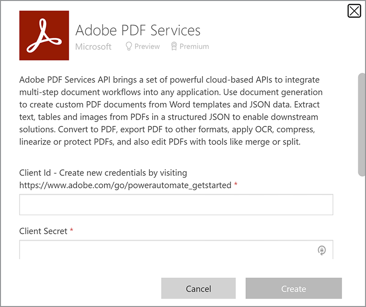

# Getting credentials for Microsoft Power Automate

[Microsoft Power Automate](https://powerautomate.microsoft.com/) provides a powerful way for citizen developers and developers to create powerful automated processes to improve their businesses without writing code. [Adobe PDF Services](https://us.flow.microsoft.com/en-us/connectors/shared_adobepdftools/adobe-pdf-services/) connector, as part of [[!DNL Adobe Acrobat Services]](https://developer.adobe.com/document-services), allows users to perform any of the actions available in Adobe PDF Services API within Microsoft Power Automate.  

In this tutorial, learn how to get credentials to start using or trialing Adobe PDF Services. Depending on whether you are a trial user or an existing customer, this tutorial walks through the proper steps to get credentials.   

## How can Microsoft Power Automate users start using Adobe PDF Services connector? 

Existing Microsoft Power Automate users can [get trial credentials](https://www.adobe.com/go/powerautomate_getstarted) for Adobe PDF Services. The link above is a special signup link to help in this process specifically for Microsoft Power Automate users. 


>[!IMPORTANT]
> If you are logging in for a trial, you must use an Adobe ID and not an Enterprise ID. If you are not a current subscriber to Adobe PDF Services API and try to log in with your Enterprise ID, you may get a permissions error because your enterprise has not entitled you to use Adobe PDF Services API. For this reason, it is recommended you use a personal Adobe ID which is free. 
>

1. After signing in, you are prompted to select a name for your new credentials. Enter your *Credential Name*.
1. Select the checkbox to agree to the developer terms.
1. Select **[!UICONTROL Create Credentials]**.

    

These credentials cover five different values:

* Client ID (API Key) 
* Client Secret 
* Organization ID 
* Technical Account ID 
* Base64 (Encoded Private Key) 


A JSON file containing all of these values is also automatically downloaded to your system. This file is named `pdfservices-api-pa-credentials.json` and looks like:

```json
{
 "client_id": "client id value",
 "client_secret": "client secret value",
 "organization_id": "organized id value",
 "account_id": "account id value",
 "base64_encoded_private_key": "base64 version of the private key"
}
```

Store this file in a secure location because it is not possible to get a copy of the private key again. 

### Add connection in Microsoft Power Automate

Now that you have your credentials, you can begin using them in Microsoft Power Automate flows. 

1. In the sidebar menu, open the **[!UICONTROL Data]** menu and select **Connections**:

    

1. Select **+ [!UICONTROL New Connection]**.

1. The next screen shows a list of possible connection types. In the upper right-hand corner, enter "adobe" to filter the options:

    

1. Select **[!UICONTROL Adobe PDF Services (preview)]**.
1. In the modal window, enter all five values you generated earlier. Select **[!UICONTROL Create]** when done.

    

You are now ready to use Adobe PDF Services in Microsoft Power Automate.

### Accessing credentials after they are created

If you already created credentials and misplaced the downloaded credentials, you can retrieve them again in [Adobe Developer Console](https://developer.adobe.com/console).

1. After logging in to [Adobe Developer Console](https://developer.adobe.com/console), first find your project and select it.
1. In the left-hand menu under *Credentials*, select **Service Account (JWT)**:

    

1. Note the five values that are presented here: *Client ID*, *Client Secret*, *Technical Account ID*, *Technical Account Email*, and *Organization ID*.

Unfortunately, you cannot download the previous private key, but you can use the "Generate a public/private keypair" button to create a new one.

## Using existing Adobe PDF Services credentials 

If you have existing Adobe PDF Services API credentials generated from [!DNL Adobe Acrobat Services] website, you can use them with Microsoft Power Automate. If you downloaded an SDK while signing up, your existing credentials came in the form of a JSON file most likely named `pdfservices-api-credentials.json`. That JSON file contains the five keys needed when creating your connection credentials. Copy each value from the JSON file into the corresponding connection field. 

Your private key value comes from a second file named `private.key`.

You can also get the values from Adobe Developer Console as described above.

## How can [!DNL Adobe Acrobat Services] users start working with Microsoft Power Automate?

To get started working with Power Automate, first head to <https://powerautomate.microsoft.com> and use the "Start free" button. If you do not have a Microsoft account you need to make one. After signing in, you are presented with the Power Automate dashboard.


As described at the beginning of this tutorial, create a new flow, add a step, and find the Adobe PDF Services. Select an action, and you may be warned that a premium account is required.


As the screenshot above shows, you can either switch to a work account or set up a new organization account. Once you have, you are then able to add the Adobe PDF Services action.

For a deeper look at creating your first Microsoft Power Automate flow with [!DNL Adobe Acrobat Services], see [Create your first workflow in Microsoft Power Automate](https://experienceleague.adobe.com/docs/document-services/tutorials/pdfservices/create-workflow-power-automate.html).

## Additional resources

To help you more, here is a list of additional resources:

* First up are the Adobe PDF Services Power Automate docs: <https://docs.microsoft.com/en-us/connectors/adobepdftools/>. These resources complement what you learned here.
* Need examples? You can find numerous [Power Automate templates](https://powerautomate.microsoft.com/en-us/connectors/details/shared_adobepdftools/adobe-pdf-services/) demonstrating the PDF Services.
* Our live video content, [Paper Clips](https://www.youtube.com/playlist?list=PLcVEYUqU7VRe4sT-Bf8flvRz1XXUyGmtF), also contains videos demonstrating Power Automate usage.
* The [Adobe Tech Blog](https://medium.com/adobetech/tagged/microsoft-power-automate) has many articles on working with Power Automate.
* Finally, be sure to consult the core [PDF Services](https://developer.adobe.com/document-services/docs/overview/) documentation as well.
