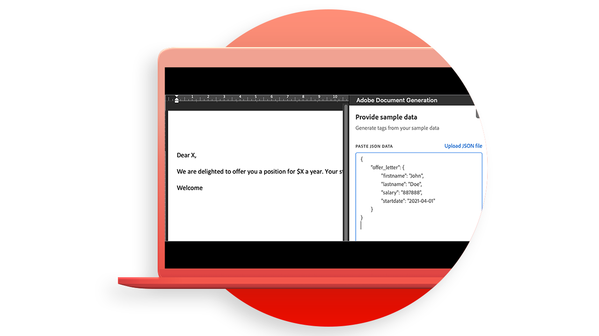

# [!DNL Adobe Acrobat Services] API use cases

![[!DNL Acrobat Services] API Use Case Banner](../assets/usecaseshero.jpg)

## What can the [!DNL Adobe Acrobat Services] APIs do for me?

Learn how the [!DNL Adobe Acrobat Services] APIs can change your business with these hands-on use cases.

### [!DNL Acrobat Services] APIs

<table style="table-layout:fixed">
<tr>
  <td>
    
    

    <a href="automatelegalworkflows.md"><strong>Automate legal workflows</strong></a>
    

    <em>Learn how to automate legal workflows with conditional content</em>
     
  </td>
  <td>
      
      

      <a href="employeeonboarding.md"><strong>Modernizing employee onboarding</strong></a>
      

      <em>Learn how to modernize employee onboarding</em>
       
  </td>
  <td>
      
      

      <a href="acceleratesales.md"><strong>Accelerate your sales process</strong></a>
      

      <em>Learn how to accelerate sales by integrating document experiences</em>
       
    </td>
    <td>
      
      

      <a href="sales.md"><strong>Managing sales proposals and contracts</strong></a>
      

      <em>Learn how to build an efficient workflow to automate and simplify sales proposals</em>
       
    </td>
</tr>
<tr>
  <td>
    
    

    <a href="nda.md"><strong>Creating an NDA</strong></a>
    

    <em>Learn how to create a dynamic NDA PDF for collaboration</em>
     
  </td>
  <td>
    
    

    <a href="legal.md"><strong>Managing legal contracts</strong></a>
    

    <em>Learn how to automatically generate and protect legal documents with custom data input</em>
     
  </td>
  <td>
    
    

    <a href="offer.md"><strong>Managing employee offer letters</strong></a>
    

    <em>Learn how to generate an offer letter that can be delivered to a new employee for their signature</em>
     
  </td>
  <td>
    
    

    <a href="searching.md"><strong>Searching and indexing</strong></a>
    

    <em>Learn how to create searchable PDF files from scanned documents</em>
     
  </td>
</tr>
<tr>
  <td>
    
    

    <a href="reviews.md"><strong>Reviews and approvals</strong></a>
    

    <em>Learn how to build a document review and approval workflow for cross-team collaboration</em>
     
  </td>
  <td>
    
    

    <a href="reportcreation.md"><strong>Report creation and editing</strong></a>
    

    <em>Learn how to generate PDF reports on your website for customers</em>
     
  </td>
  <td>
    
    

    <a href="jobposting.md"><strong>Job posting</strong></a>
    

    <em>Learn how to develop a smooth and consistent web experience for job applicants and employers</em>
     
  </td>
  <td>
    
    

    <a href="educationcollab.md"><strong>Student-Teacher collaboration</strong></a>
    

    <em>Learn how to create an online learning platform that enables teachers and students to easily share resources in PDF</em>
     
  </td>
</tr>
<tr>
  <td>
    
    

    <a href="AgreementWorkflowsNodejs.md"><strong>Agreement workflows in Node.js</strong></a>
    

    <em>[!DNL Adobe Acrobat Services] APIs easily incorporate PDF capabilities into your web applications</em>
     
  </td>
  <td>
    
    

    <a href="HRAgreementWorkflowsJava.md"><strong>HR document workflows in Java</strong></a>
    

    <em>[!DNL Adobe Acrobat Services] APIs easily incorporate PDF capabilities into your HR web applications</em>
     
  </td>
  <td>
    
    

    <a href="FinanceWorkflowsJava.md"><strong>Managing financial document workflows in Java</strong></a>
    

    <em>[!DNL Adobe Acrobat Services] provides all the necessary tools, services, and features to process and extract data from PDF financial documents</em>
     
  </td>
  <td>
    
    

     
  </td>
</tr>
</table>

### Document Generation APIs

<table style="table-layout:fixed">
<tr>
  <td>
    
    

    <a href="invoices.md"><strong>Handling invoices</strong></a>
    

    <em>Learn how to automatically generate, password-protect, and deliver customer invoices</em>
     
  </td>
  <td>
    
    

     
  </td>
  <td>
    
    

     
  </td>
  <td>
    
    

     
  </td>
</tr>
</table>

### PDF Embed API

<table style="table-layout:fixed">
<tr>
   <td>
    
    

    <a href="ddppdfembedapi.md"><strong>Digital document publishing</strong></a>
    

    <em>Learn how to display embedded PDF documents inside web pages using Adobe PDF Embed API</em>
     
  </td>
  <td>
    
    

     
  </td>
  <td>
    
    

     
  </td>
  <td>
    
    

     
  </td>
</tr>
</table>